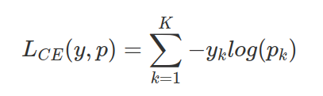
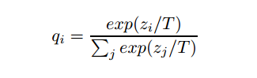
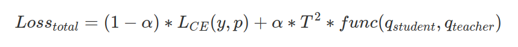

# Knowledge Distillation
Teacher-Student Mechanism to compress model & improve compact models
 

## Loss functions & Details
Standard Cross-entropy Loss between true targets y<sub>k</sub> and the network's outputs p<sub>k</sub><br>


#### 1. Knowledge Distillation <sup>[1]</sup>
Use soft label produced by teacher model to direct student model.<br>
Softmax output layer converts the logit z<sub>i</sub> computed for each class into a probability, q<sub>i</sub>,
by comparing z<sub>i</sub> with the other logits.<br>
 <br>
* T: temperature, the higher temperature is, the softer probability distribution is;<br>
* z: logits<br>

If correct labels are known for all or sim of the transfer set, use a weighted average of two different 
objective functions.
```
1. cross entropy loss with the soft targets 
2. cross entropy loss with the correct labels
```
* Best results obtained by using a lower weight of second loss; 
* It's important to multiply 1<sup>st</sup> loss by T<sup>2</sup> when using both the two losses.




#### 2. Attention Transfer <sup>[2]</sup>


#### 3. Neural Selectivity Transfer <sup>[3]</sup>


#### 4. Flow of Solution Procedure <sup>[4]</sup>


#### 5. FitNets<sup>[5]</sup>

## Training Scripts
Please see the [Training recipes](TRAINING.md) for how to train the models.


## Results
#### CIFAR
Top1 error rate on the CIFAR-10/100 benchmarks are reported. You may get different results when training your models with different random seed.
Note that the number of parameters are computed on the CIFAR-10 dataset.\
```Top-1 Accuracy is the best one, while Top-5 is one at the last epoch.```

| Model             | Param (M)      | CIFAR-10 Top1 (%) | CIFAR-10 Top5 (%) |
| ----------------- | -------------- | ----------------- | ----------------- |
| ResNet-20         | 0.27           | 91.70             | 99.71             |
| ResNet-32         | 0.47           | 92.93             | 99.73             |
| ResNet-44         | 0.66           | 93.32             | 99.76             |
| ResNet-56         | 0.86           | 93.63             | 99.75             |
| ResNet-110        | 1.73           | 93.77             | 99.78             |

| Model             | Param (M)      | CIFAR-100 Top1 (%) | CIFAR-100 Top5 (%) |
| ----------------- | -------------- | ------------------ | ------------------ |
| ResNet-20         | 0.28           | 67.86              | 90.11              |
| ResNet-32         | 0.47           | 69.96              | 90.81              |
| ResNet-44         | 0.67           | 70.56              | 91.33              |
| ResNet-56         | 0.86           | 71.09              | 91.56              |
| ResNet-110        | 1.74           | 71.85              | 91.36              |


## Supported Algorithms
* [x] Knowledge Distillation (KD): [Distilling the Knowledge in a Neural Network](https://arxiv.org/abs/1503.02531v1)
* [x] Attenion Transfer (AT): [Paying More Attention to Attention: Improving the Performance of 
Convolutional Neural Networks via Attention Transfer](https://arxiv.org/abs/1612.03928v3)
* [x] Neural Selectivity Transfer (NST): [Like What You Like: Knowledge Distill via Neuron Selectivity Transfer](https://arxiv.org/abs/1707.01219)
* [x] Flow of Solution Procedure (FSP): [A Gift From Knowledge Distillation: Fast Optimization, 
Network Minimization and Transfer Learning](https://zpascal.net/cvpr2017/Yim_A_Gift_From_CVPR_2017_paper.pdf)
* [ ] FitNets: [FitNets: Hints for Thin Deep Nets](https://arxiv.org/abs/1412.6550)
