# Knowledge Distillation for Image Classification
Teacher-Student Mechanism to compress model & improve compact models
 

## Loss functions & Details
Standard Cross-entropy Loss between true targets y<sub>k</sub> and the network's outputs p<sub>k</sub><br>


### 1. Knowledge Distillation <sup>[1]</sup>
###### Use soft label produced by teacher model to direct student model.<br>

Softmax output layer converts the logit *z<sub>i</sub>* computed for each class into a probability, *q<sub>i</sub>*,
by comparing *z<sub>i</sub>* with the other logits.<br>
 <br>
```
where
* T: temperature, the higher temperature is, the softer probability distribution is;
* z: network's output logits; 
```
Notes: 
* If teacher model is the result of an ensemble, either *z* or *q* are obtained by averaging outputs of models.

* If correct labels are known for all or some of the transfer set, use a weighted average of two different 
objective functions.
  1. cross entropy loss with the soft targets 
  2. cross entropy loss with the correct labels
  3. Empirically,
  * Best results obtained by using a lower weight of second loss; 
  * It's important to multiply 1<sup>st</sup> loss by T<sup>2</sup> when using both the two losses.
* KD would perform better with more classes since more classes provide more accurate information about intra-class 
variation in the softened softmax target
#### Total loss function: <br>


#### **Experiments on CIFAR:** <br>
|Method |Setting                                                    |
| ----- | --------------------------------------------------------- |
|KD     |*T* = 4, *α* = 0.9                                         |


### 2. FitNets<sup>[2]</sup>
###### Compress *wide & shallow* networks into *narrow & deep* networks
###### Introduce *intermediate-level* hints to guide student
#### 2.1 Definitions
|             |                                                                       |
| ----------- | --------------------------------------------------------------------- |
|Hint         |Output of teacher's hidden layer; responsible for guiding student      |
|Hint Layer   |The hidden layer in teacher model                                      |
|Guided Layer |The chosen hidden layer in student model                               |
|Regressor    |Add to guided layer, outputs matches the size of hint layer            |
* The deeper the guided layer is , the less flexibility the network has, the more possibly the model get over-regularization. 
#### 2.2 Stage-wise Training
1. Stage I: Pre-train student network up to guided layer, based on the prediction error of the teacher's hint layer<br>
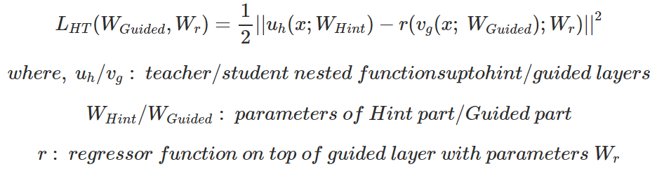
2. Stage II: KD training of the whole network<br>
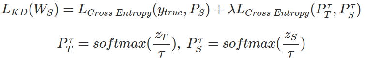


#### Training Scheme
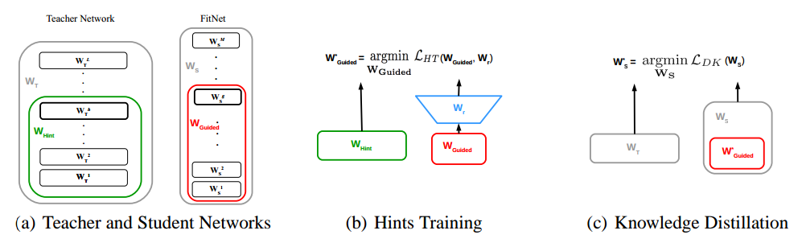

#### **Experiments on CIFAR:** <br>
|Method              |Setting                                                                     |
| ------------------ | -------------------------------------------------------------------------- |
|KD                  |*T* = 4, *λ* = 0.9                                                          |
|FitNet (Maxout Net) |I.  Optimize first half *w.r.t.* hints;                                     |
|                    |II. Optimize the whole network *w.r.t. L<sub>KD</sub>*; *T* = 4, *λ* = 0.9  |
* **Further Comparisons:**<br>
Alternative methods to hint student with desired output (classification labels)<br>

|     |Train                                                                                                                   |
| --- | ---------------------------------------------------------------------------------------------------------------------- |
|1    |(1) Optimize first half *w.r.t.* classification targets; (2) Optimize the whole network *w.r.t.* classification targets |
|2    |(1) Optimize first half *w.r.t.* classification targets; (2) Optimize the whole network *w.r.t. L<sub>KD</sub>*         |
|3    |Jointly optimize *w.r.t.* sum of hint for the guided layer & classification targets for the output layer                |
|4    |Jointly optimize *w.r.t.* sum of hint for the guided layer & *L<sub>KD</sub>* for the output layer                      |

First stage with classification target doesn't help stage 2 sufficiently, while hints of targets may be so aggressive 
that Jointly optimizing fails to learn. 


### 3. Attention Transfer <sup>[3]</sup>
**Feature map** *R<sup> CxHxW</sup>* --> **Attention map** *R<sup> HxW</sup>*

#### 3.1. Activation-based attention maps

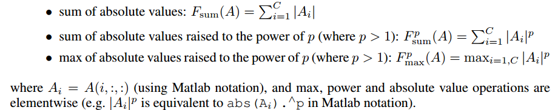

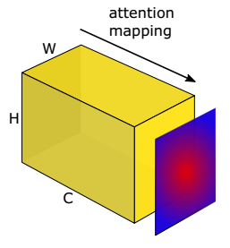

Attention Transfer  Losses Definition:<br>

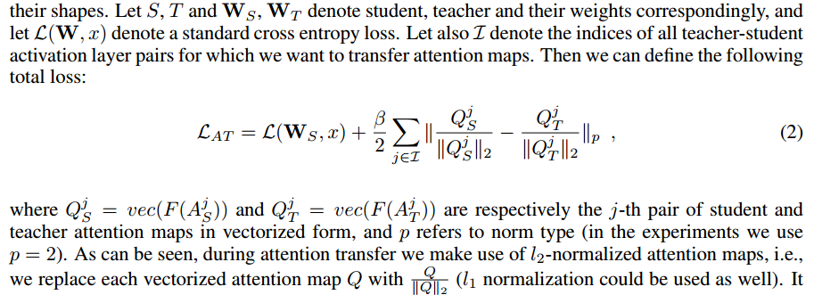
<br>
 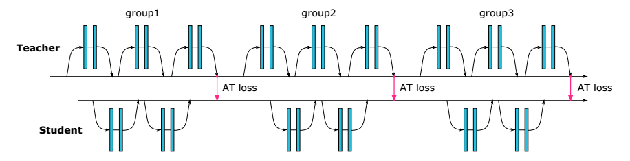
 <br>
#### **Experiments on CIFAR:** <br>
|Method     |Setting                                                                                                  |
| --------- | ------------------------------------------------------------------------------------------------------- |
|KD         |*T* = 4, *α* = 0.9                                                                                       |
|FitNet     |(1) Optimize first half *w.r.t.* hints; (2) Optimize the whole network *w.r.t. L<sub>KD</sub>* *T* = 4, *λ* = 0.9  |
|AT (WRN)   |*Mapping Function*: use sum of squared attention;                                                        |
|           |*β*: varies about 0.1. (10<sup>3</sup>/(H * W * N))                                                      |
|           |Decay *β* when using combining AT with KD                                                                |
 

#### 3.2. Gradient-based attention maps
To be completed

### 4. Neural Selectivity Transfer <sup>[4]</sup>
###### Align the distribution of activations of its intermediate layer with that of the teacher

#### 4.1 Notations
1. Shape of the whole Feature map           **F**:               **R**<sup>CxHxW</sup>;<br>
Shape of feature of each channel (row)      **f**<sup> k·</sup>: **R**<sup>HxW</sup>;<br>
Shape of feature of each position (column)  **f**<sup> ·k</sup>: **R**<sup>C</sup>.
2. **Maximum Mean Discrepancy (MMD)**<br>
Suppose we are given two sets
of samples X = {x<sup>i</sup>}<sup>N</sup><sub>i=1</sub> and Y = {y<sup>j</sup>}<sup>M</sup><sub>j=1</sub> sampled from
distributions *p* and *q*, respectively<br>
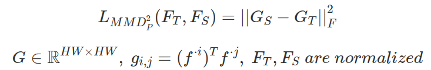
<br>
Minimizing MMD loss = minimizing the distance between *p* and *q*

#### 4.2 Neural Selectivity Transfer (NST)
##### Total loss in NST: 

<br>
1. **Formulation**<br>
  (1) Choices of Kernels<br>
  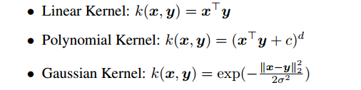
  <br>For Polynomial Kernels, set d = 2, c = 0;<br>
    - Linear Kernel<br>
    Attention Transfer is a special case of linear kernel of NST.<br>
    - Polynomial Kernel<br>
    NST with second order polynomial kernel with c = 0 can be treated as matching Gram matrix.<br>
    

    (2) Compared with directly matching feature maps in FitNet, match samples will ignores the sample density 
    in the space.

#### **Experiments on CIFAR:** <br>
|Method             |Setting                                                    |
| ----------------- | --------------------------------------------------------- |
|KD                 |*T* = 4, *λ* = 16                                          |
|FitNet             |*λ* = 100                                                  |
|AT                 |*Mapping Function*: sum of squared attention; *λ* = 1000   |
|NST (Inception BN) |*λ* = 50(Linear), 50(Polynomial), 100(Gaussian)            |


### 5. Flow of Solving a Problem <sup>[5]</sup>
###### Defined a high-level distilled knowledge as the flow of solving a problem: 
###### Gramian matrix consisting of the inner products between features from two layers

#### 5.1. Proposed Distilled Knowledge
##### Let the student learns the solution method when a specific type of question is encountered
(1) Mathematical Expression of the distilled knowledge<br>
  - *G*∈R<sup>*m*x*n*</sup> = *F*<sup>1</sup>∈R<sup>*m*xHxW</sup> · *F*<sup>2</sup>∈R<sup>*n*xHxW</sup><br>
  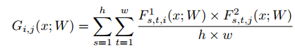
  <br>where *x* represents the input and *W* represents the weights of DNN
  
(2) Loss for FSP matrix
  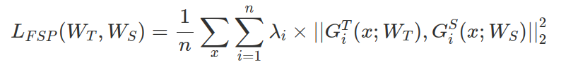
  <br>
  Consider the whole loss term is the same significant, so use the same *λ<sub>i</sub>* for all experiments.

(3) Stage-wise training<br>
  - Minimize the *L<sub>FSP</sub>* to make the FSP matrix of the student similar to that of teacher;<br>
  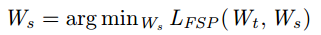
  - Train the pre-trained student by the main task loss<br> 
  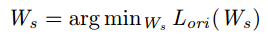
#### **Experiments on CIFAR:** <br>
|Method             |Setting                                                                                                  |
| ----------------- | ------------------------------------------------------------------------------------------------ |
|KD                 |*T* = 4, *α* = 0.9, *λ* = 16                                                                               |
|FitNet             |*λ* = 100 |
|AT                 |*Mapping Function*: sum of squared attention; *λ* = 1000   |
|NST                |*λ* = 50(Linear), 50(Polynomial), 100(Gaussian)                                         |
|FSP (ResNet)       |                                                   |


## Training Scripts
Please see the [Training recipes](TRAINING.md) for how to train the models.


## Results
#### CIFAR
Top1 error rate on the CIFAR-10/100 benchmarks are reported. You may get different results when training your models with different random seed.
Note that the number of parameters are computed on the CIFAR-10 dataset.<br>
```Top-1 Accuracy is the best one, while Top-5 is one at the last epoch.```

| Model             | Param (M)      | CIFAR-10 Top1 (%) | CIFAR-10 Top5 (%) |
| ----------------- | -------------- | ----------------- | ----------------- |
| ResNet-20         | 0.27           | 91.70             | 99.71             |
| ResNet-32         | 0.47           | 92.93             | 99.73             |
| ResNet-44         | 0.66           | 93.32             | 99.76             |
| ResNet-56         | 0.86           | 93.63             | 99.75             |
| ResNet-110        | 1.73           | 93.77             | 99.78             |

| Model             | Param (M)      | CIFAR-100 Top1 (%) | CIFAR-100 Top5 (%) |
| ----------------- | -------------- | ------------------ | ------------------ |
| ResNet-20         | 0.28           | 67.86              | 90.11              |
| ResNet-32         | 0.47           | 69.96              | 90.81              |
| ResNet-44         | 0.67           | 70.56              | 91.33              |
| ResNet-56         | 0.86           | 71.09              | 91.56              |
| ResNet-110        | 1.74           | 71.85              | 91.36              |


## Supported Algorithms
* [x] [1] Knowledge Distillation (KD): [Distilling the Knowledge in a Neural Network](https://arxiv.org/abs/1503.02531v1)
* [ ] [2] FitNets: [FitNets: Hints for Thin Deep Nets](https://arxiv.org/abs/1412.6550)
* [x] [3] Attenion Transfer (AT): [Paying More Attention to Attention: Improving the Performance of 
Convolutional Neural Networks via Attention Transfer](https://arxiv.org/abs/1612.03928v3) 
* [x] [4] Neural Selectivity Transfer (NST): [Like What You Like: Knowledge Distill via Neuron Selectivity Transfer](https://arxiv.org/abs/1707.01219)
* [x] [5] Flow of Solution Procedure (FSP): [A Gift From Knowledge Distillation: Fast Optimization, 
Network Minimization and Transfer Learning](https://zpascal.net/cvpr2017/Yim_A_Gift_From_CVPR_2017_paper.pdf)
